# OSC — Architecture Reference

> **Audience:** developers and AI agents (Claude Code).
> **Purpose:** Visual and narrative reference for every architectural layer. Read `docs/PROJECT.md` for the *why* behind decisions; read this document for the *how* and *what*.
> **Living document:** update diagrams and prose whenever a decision changes (create/reference the ADR first).

---

## Table of Contents

1. [System Overview](#1-system-overview)
2. [Module Map](#2-module-map)
3. [The Two Planes: Metadata vs Data](#3-the-two-planes-metadata-vs-data)
4. [Request Lifecycle (end-to-end)](#4-request-lifecycle-end-to-end)
5. [Multi-tenancy Model](#5-multi-tenancy-model)
6. [Metadata Engine](#6-metadata-engine)
7. [Dynamic Persistence Layer](#7-dynamic-persistence-layer)
8. [Query Engine](#8-query-engine)
9. [Security Model (Defense in Depth)](#9-security-model-defense-in-depth)
10. [Automation Engine](#10-automation-engine)
11. [AI Layer (Spring AI)](#11-ai-layer-spring-ai)
12. [Frontend Renderer Architecture](#12-frontend-renderer-architecture)
13. [Integration Layer (Webhooks & Outbox)](#13-integration-layer-webhooks--outbox)
14. [Database Schema (ER Diagram)](#14-database-schema-er-diagram)
15. [Reactive Programming Model](#15-reactive-programming-model)
16. [Infrastructure Topology](#16-infrastructure-topology)
17. [Implementation Phases at a Glance](#17-implementation-phases-at-a-glance)

---

## 1. System Overview

OSC is a **metadata-driven, multi-tenant business application engine** (PaaS/SaaS). Tenants configure objects, fields, validations, automations, and layouts at runtime — no code deployment required. The platform is the runtime interpreter of that configuration.

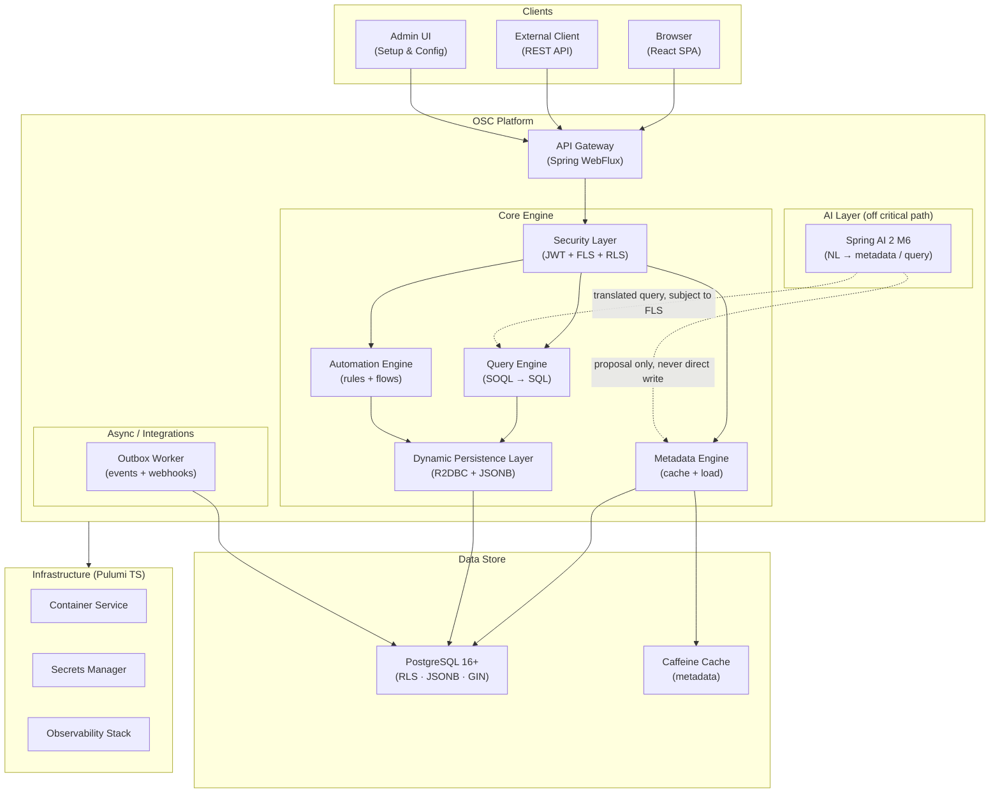

**Key principle:** the AI layer is **never on the critical path** of a data operation. The engine is deterministic; AI is a productivity layer on top.

---

## 2. Module Map

The repository is a **Gradle multi-project monorepo**. Each backend module has a single responsibility.

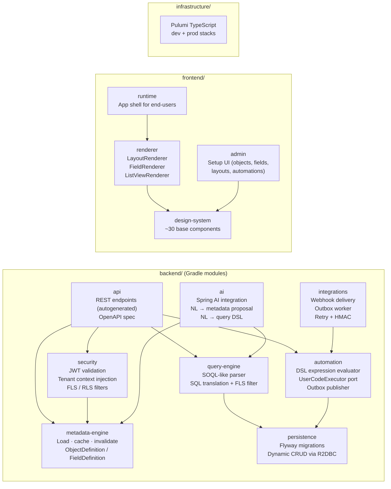

**Dependency rule:** modules flow downward. `api` → `security` → `metadata-engine` → `persistence`. No upward or circular dependencies.

---

## 3. The Two Planes: Metadata vs Data

Everything in OSC is built on the separation of **what a record type *is*** (metadata) from **the records themselves** (data).

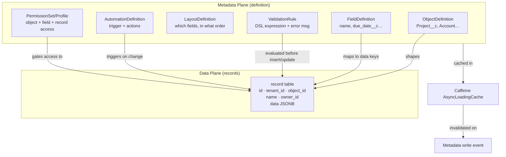

**For AI agents:** when generating code that touches records, always load the `ObjectDefinition` from `MetadataEngine` first. Never hardcode field names or table names beyond `record`, `md_object`, `md_field`.

---

## 4. Request Lifecycle (end-to-end)

This is the most important flow to understand. Every record mutation goes through every layer.

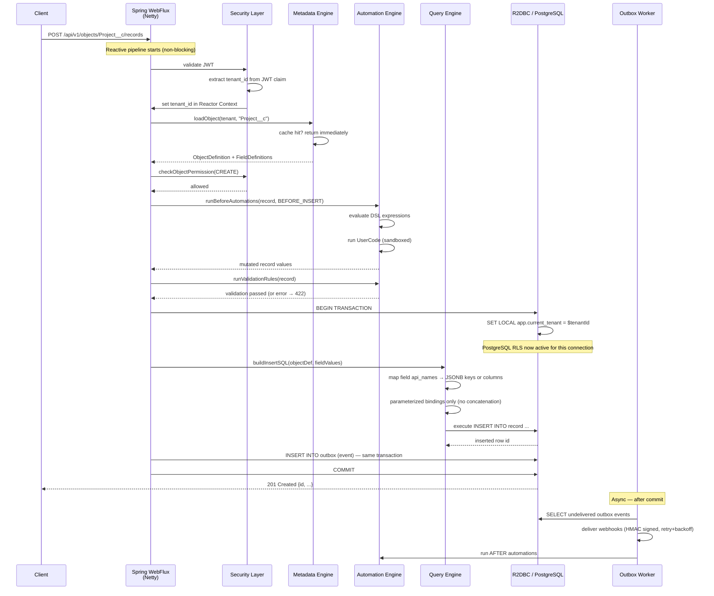

---

## 5. Multi-tenancy Model

Tenant isolation is enforced at **two independent layers** (defense in depth). Both must pass.

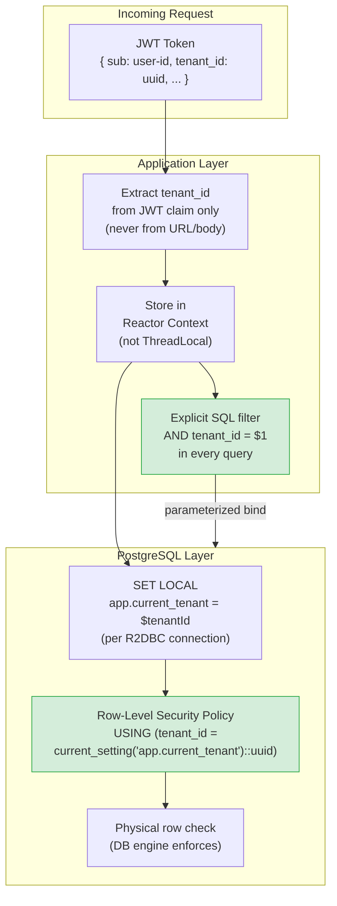

**Rules for AI agents:**
- `tenant_id` **only** comes from `Reactor Context` → `ctx.get(TENANT_KEY)`.
- Every query must have `AND tenant_id = $N` even with RLS enabled.
- Every new table needs `tenant_id UUID NOT NULL` and an RLS policy in its Flyway migration.

---

## 6. Metadata Engine

The Metadata Engine is the most read-intensive subsystem. It is the single source of truth about object/field definitions at runtime.

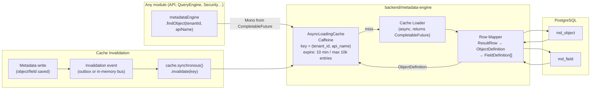

**Key types:**
- `ObjectDefinition` — immutable record: `(id, tenantId, apiName, label, labelPlural, isCustom, fields)`
- `FieldDefinition` — immutable record: `(id, tenantId, objectId, apiName, label, fieldType, isRequired, isUnique, storageKind, storageKey, config)`
- `MetadataKey` — cache key: `(tenantId, apiName)` for objects; `(tenantId, objectId, apiName)` for fields.

---

## 7. Dynamic Persistence Layer

Records are stored in a single universal table. Custom fields live in the `data JSONB` column unless explicitly promoted.

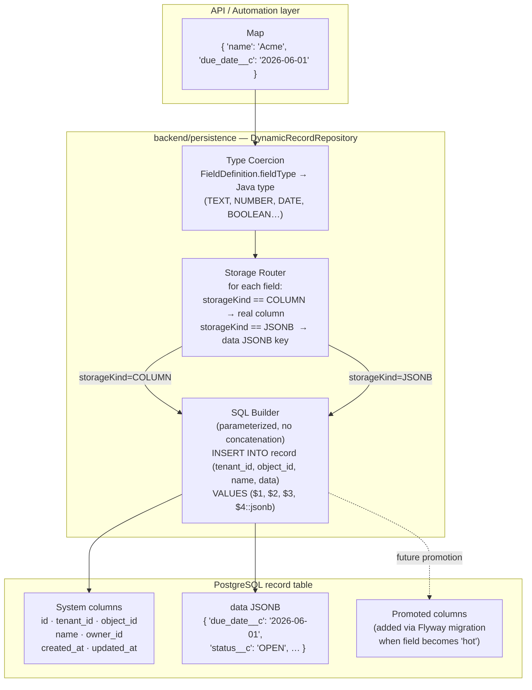

**Storage kinds:**

| Category | Storage | Example |
|---|---|---|
| System fields | Real columns | `id`, `tenant_id`, `name`, `owner_id`, `created_at` |
| All custom fields (default) | `data` JSONB | `data->>'due_date__c'` |
| Hot promoted fields | Real columns (Flyway migration) | `due_date` column added manually |

**No dynamic DDL at runtime.** `CREATE/ALTER TABLE` never happens in application code.

---

## 8. Query Engine

The Query Engine translates a SOQL-like query string into a safe, parameterized SQL statement. It is the only place where user-supplied field/object names are mapped to SQL constructs.

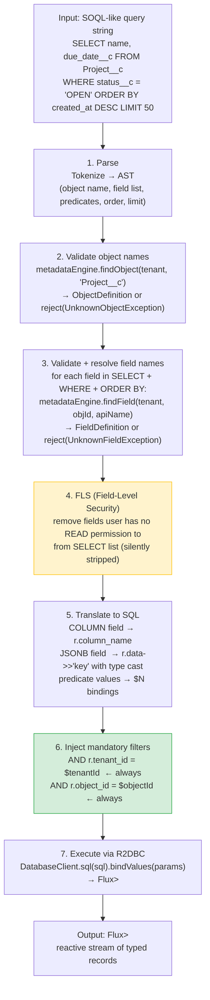

**Generated SQL example:**

```sql
-- Input: SELECT name, due_date__c FROM Project__c WHERE status__c = 'OPEN'
SELECT r.name,
       r.data->>'due_date__c' AS "due_date__c"
FROM   record r
WHERE  r.tenant_id = $1          -- injected, non-negotiable
  AND  r.object_id = $2          -- resolved from metadata
  AND  r.data->>'status__c' = $3 -- JSONB field predicate
ORDER BY r.created_at DESC
LIMIT  50
-- Bindings: [$tenantId, $projectObjectId, 'OPEN']
```

---

## 9. Security Model (Defense in Depth)

Security is layered: each layer is independent and can catch what an upstream layer might miss.

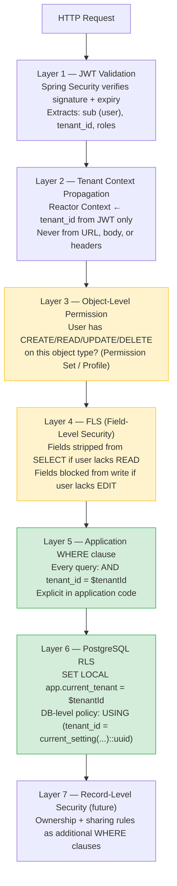

**Security invariants (enforced by tests):**
- Cross-tenant query must return empty — never data, never an error that leaks existence.
- SQL injection attempt must return empty or an explicit error — never data.
- A user without field READ permission must never see that field in any response.

---

## 10. Automation Engine

Automations fire at specific points in the record lifecycle. The execution cycle is fixed and deterministic.

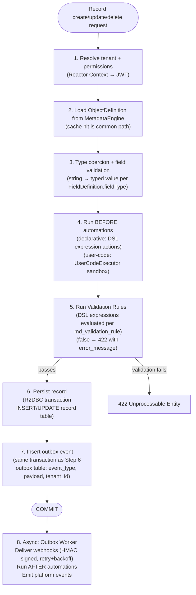

### Expression DSL (safe evaluator)

The DSL evaluator uses a whitelist — it is **not** a general-purpose language interpreter.

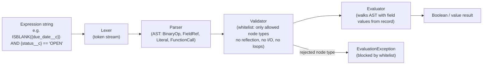

**Allowed DSL operations:** comparisons (`==`, `!=`, `<`, `>`, `<=`, `>=`), boolean logic (`AND`, `OR`, `NOT`), field references `{api_name}`, pure functions: `ISBLANK()`, `LEN()`, `CONTAINS()`, `TODAY()`, `NOW()`, `ROUND()`, `FLOOR()`, `CEILING()`.

---

## 11. AI Layer (Spring AI)

The AI layer is a **productivity enhancement only**. It never writes to the system directly.

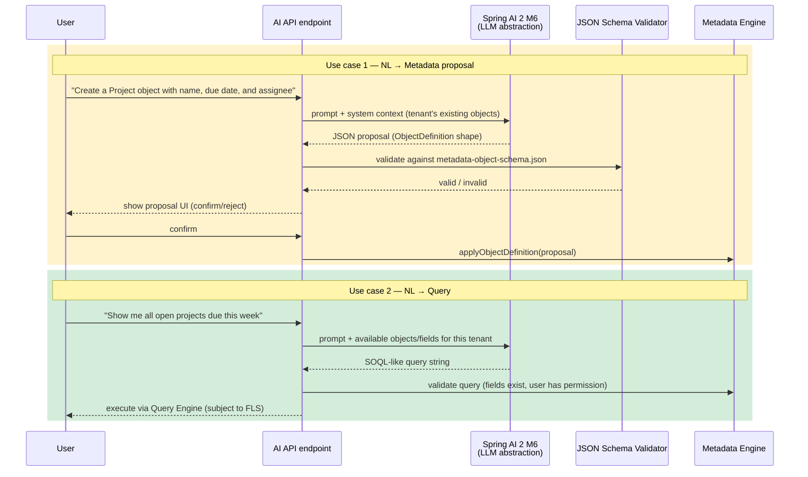

**AI safety constraints:**
- AI output is always validated against JSON Schema before any system mutation.
- AI never receives DB credentials, connection strings, or raw SQL.
- AI cannot bypass tenant isolation, FLS, or RLS.
- All AI calls are `Mono<AIResponse>` — non-blocking, never `.block()`.
- Human confirmation is required for any metadata mutation proposed by AI.

---

## 12. Frontend Renderer Architecture

The frontend is a **metadata-driven rendering engine**, not a collection of hardcoded entity screens.

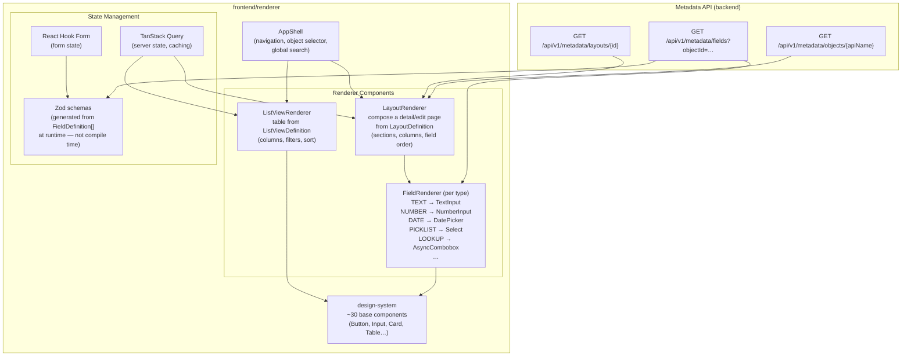

**Rendering flow:**
1. `AppShell` detects object `apiName` from URL.
2. `TanStack Query` fetches `ObjectDefinition` + `LayoutDefinition` from metadata API.
3. `LayoutRenderer` reads `definition.sections[].columns[].fields[]` and renders `FieldRenderer` per field.
4. `Zod` schema is generated dynamically from `FieldDefinition[]` (required, type, max length).
5. `React Hook Form` uses the generated Zod schema for real-time validation.

---

## 13. Integration Layer (Webhooks & Outbox)

Outbound integrations use the **transactional outbox pattern** to guarantee at-least-once delivery without distributed transactions.

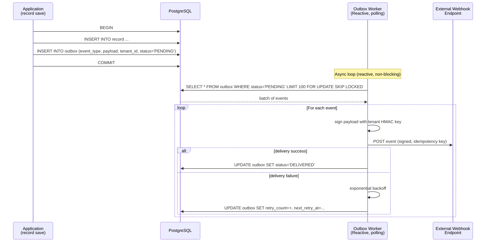

**Outbox table:**
```sql
CREATE TABLE outbox (
    id             UUID PRIMARY KEY DEFAULT gen_random_uuid(),
    tenant_id      UUID NOT NULL,
    event_type     TEXT NOT NULL,      -- e.g. 'record.created', 'record.updated'
    object_api_name TEXT NOT NULL,
    record_id      UUID,
    payload        JSONB NOT NULL,
    status         TEXT NOT NULL DEFAULT 'PENDING',
    retry_count    INT NOT NULL DEFAULT 0,
    next_retry_at  TIMESTAMPTZ,
    created_at     TIMESTAMPTZ NOT NULL DEFAULT now()
);
```

---

## 14. Database Schema (ER Diagram)

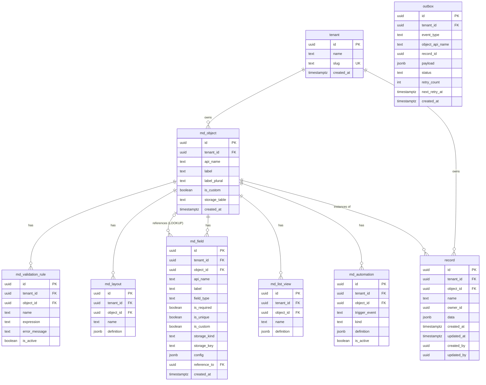

---

## 15. Reactive Programming Model

All I/O in OSC is non-blocking. This section is critical for AI agents writing backend code.

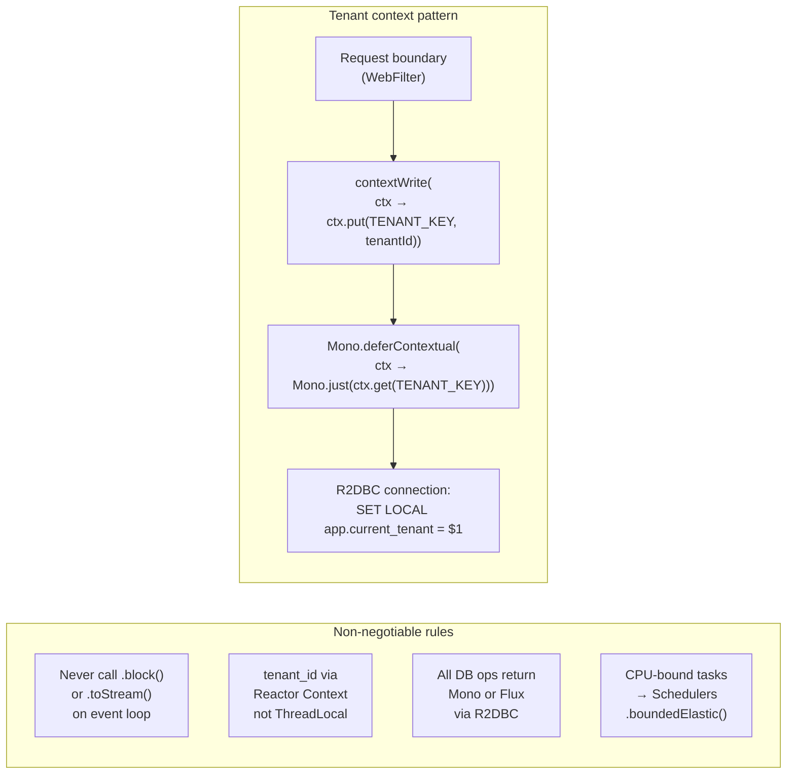

**Correct reactive pattern:**
```java
// ✅ Correct — reactive with Reactor Context
public Mono<Record> findById(UUID id) {
    return Mono.deferContextual(ctx -> {
        String tenantId = ctx.get(TENANT_KEY);
        return databaseClient
            .sql("SELECT * FROM record WHERE id = $1 AND tenant_id = $2")
            .bind("$1", id)
            .bind("$2", tenantId)
            .map(this::mapRow)
            .one();
    });
}

// ❌ Wrong — blocks the event loop
public Record findById(UUID id) {
    return databaseClient.sql("...").map(this::mapRow).one().block();
}

// ❌ Wrong — ThreadLocal breaks in reactive
public Mono<Record> findById(UUID id) {
    String tenantId = TenantHolder.get(); // ThreadLocal = broken in WebFlux
    ...
}
```

**Transaction pattern:**
```java
// R2DBC reactive transaction
transactionalOperator.execute(tx ->
    setTenantSession(tenantId)
        .then(databaseClient.sql("INSERT INTO record ...").fetch().rowsUpdated())
        .then(databaseClient.sql("INSERT INTO outbox ...").fetch().rowsUpdated())
).subscribe();
```

---

## 16. Infrastructure Topology

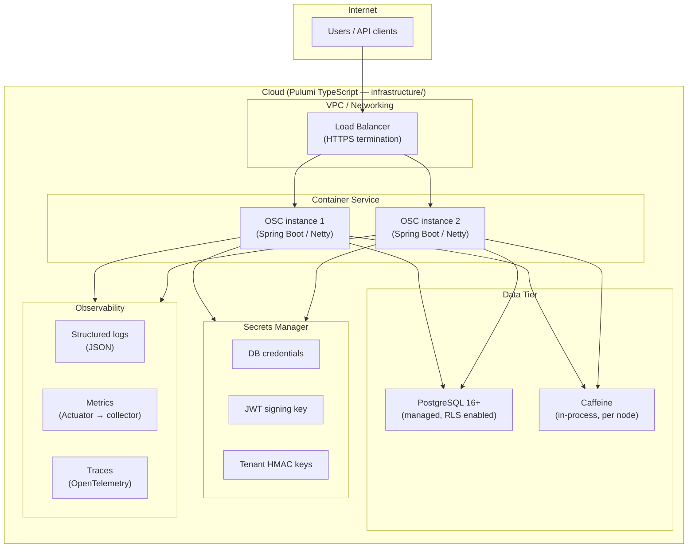

**Deployment notes:**
- Monolithic-modular at launch (all backend modules in one deployable JAR).
- Pulumi stacks: `dev` and `prod`. References services from `hneyra/iaac`.
- Local development: `docker-compose` with PostgreSQL + application.
- Cache is in-process (Caffeine) per node; invalidation events ensure consistency across nodes.

---

## 17. Implementation Phases at a Glance

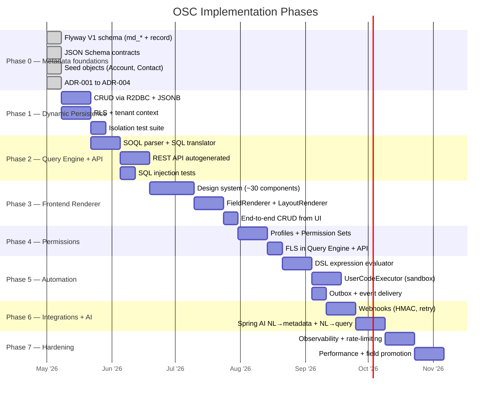

---

## Quick Reference for AI Agents

| Task | Where to look |
|---|---|
| Adding a new backend module | `backend/<module>/build.gradle.kts` — follow existing pattern |
| Writing a reactive DB query | See §15 — use `Mono.deferContextual` + R2DBC bindings |
| Adding a new metadata table | `backend/persistence/src/main/resources/db/migration/V{N}__desc.sql` — include `tenant_id`, RLS policy |
| Using object/field metadata | Inject `MetadataEngine`, call `findObject(tenantId, apiName)` — never query `md_object` directly |
| Building a query | Use `QueryEngine` — never concatenate user input into SQL |
| Cross-tenant isolation test | See §9 — result must be empty (not forbidden) |
| Non-trivial architectural decision | Write `docs/adr/ADR-XXX-title.md` before implementing |
| Understanding data storage | See §7 — all custom fields → `data JSONB`, no dynamic DDL |
| AI integration | See §11 — AI proposes, human confirms, schema validates |
