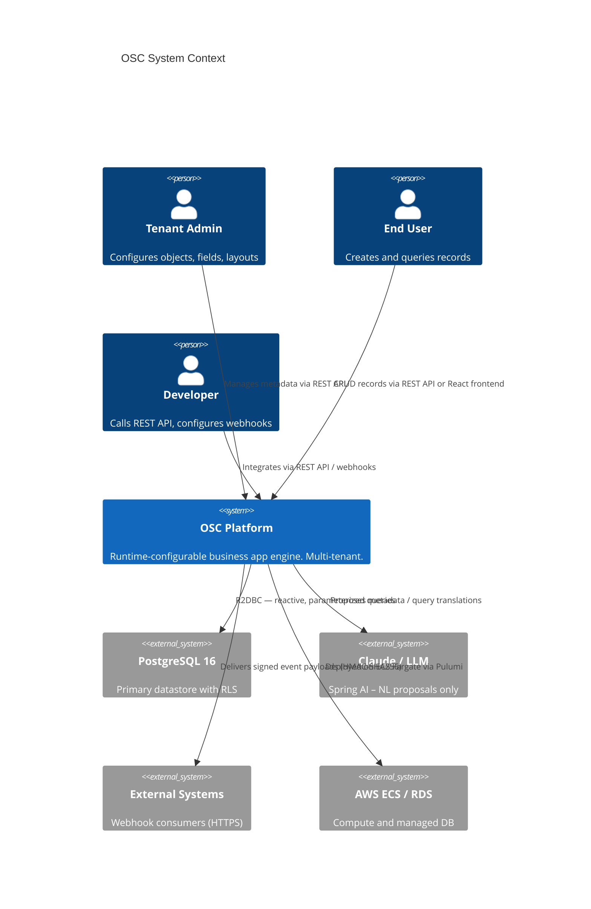
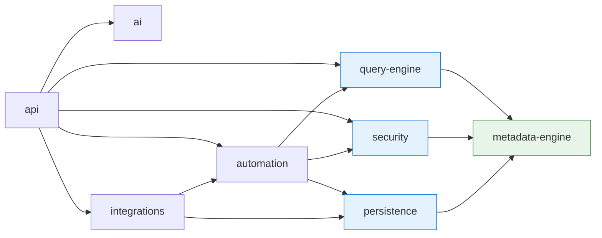
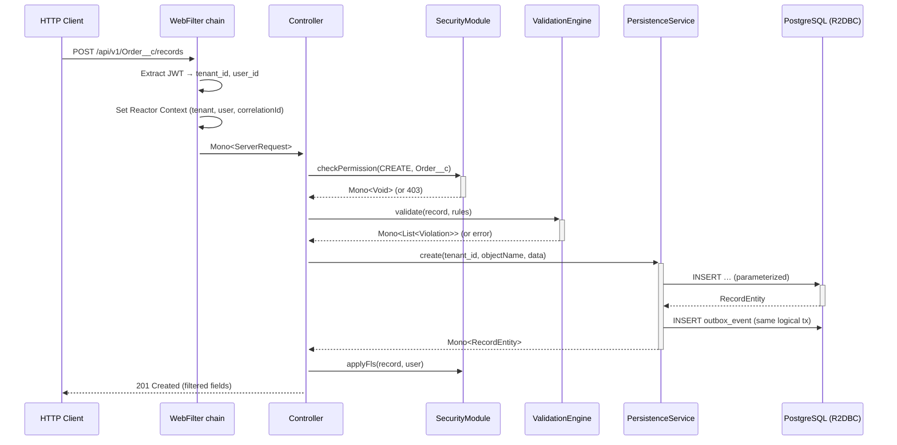
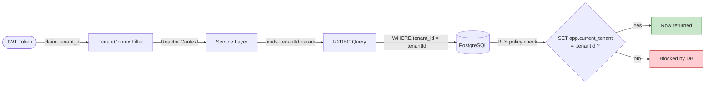
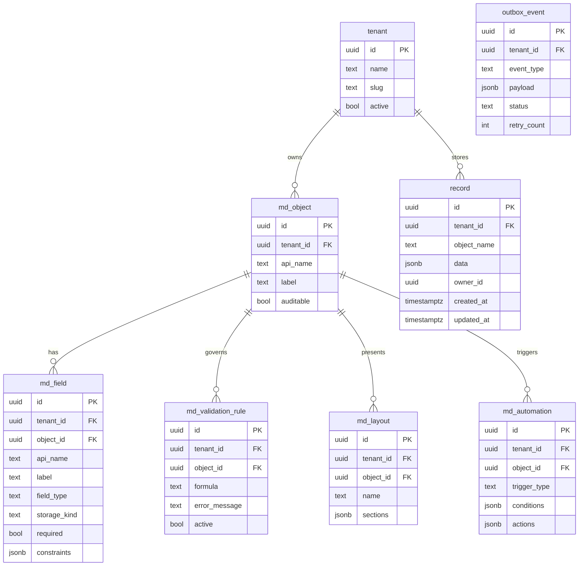
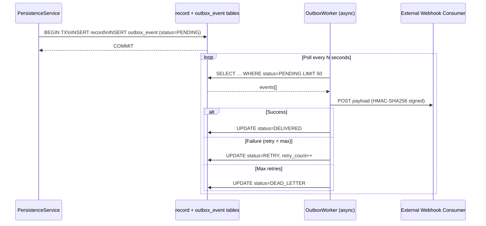
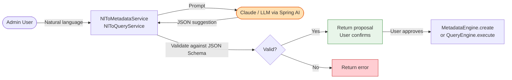
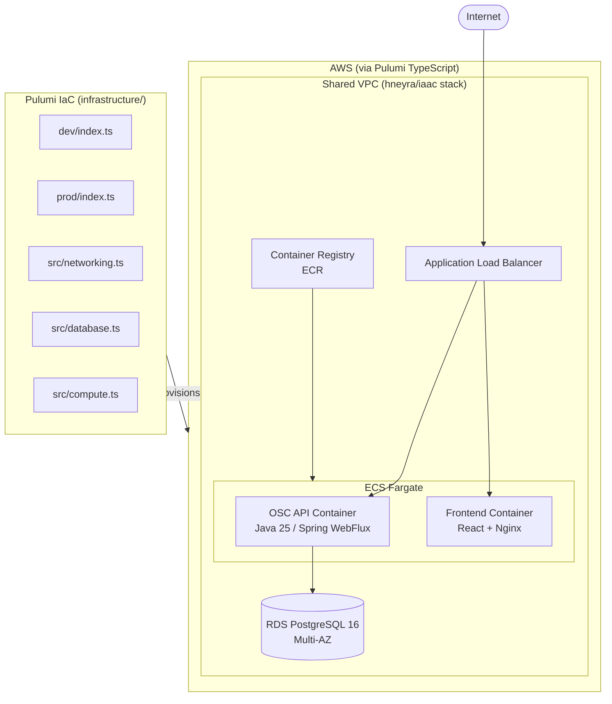

# OSC — Architecture Reference

## 1. System Context

OSC is a **metadata-driven, multi-tenant PaaS** that lets tenants define business objects at runtime without code deployments. Think Salesforce's object model as a service.



## 2. Two-Plane Architecture

OSC separates concerns into two planes with radically different characteristics.

```mermaid
flowchart TB
  subgraph MP["Metadata Plane (stable, cached)"]
    direction LR
    MD_OBJ[md_object]
    MD_FIELD[md_field]
    MD_LAYOUT[md_layout]
    MD_VIEW[md_list_view]
    MD_RULE[md_validation_rule]
    MD_AUTO[md_automation]
  end

  subgraph DP["Data Plane (unbounded growth)"]
    RECORD[record\ntenant_id, object_name, data JSONB, promoted columns]
  end

  subgraph CACHE["Caffeine L1 Cache (per tenant)"]
    CACHE_OBJ[ObjectDefinition]
    CACHE_FIELD[FieldDefinition[]]
  end

  MP -->|loaded on first access| CACHE
  CACHE -->|drives| DP
  DP -->|field access stats feed| CACHE
```

**Metadata Plane properties:**
- Changes infrequently (admin actions only)
- Fully cached in Caffeine per tenant
- Drives everything: rendering, validation, queries, security

**Data Plane properties:**
- Grows unboundedly as users create records
- Single universal `record` table with JSONB `data` column
- GIN index on `data` for fast attribute lookups
- Hot fields can be promoted to native columns without schema changes (see ADR-002)

## 3. Layered Architecture

```mermaid
flowchart TD
  Client([HTTP Client / React Frontend])

  subgraph API["api module — Spring WebFlux"]
    WF[WebFilter chain\nCORS → CorrelationId → RateLimit → TenantContext → UserContext → MDC → Metrics]
    CTRL[DynamicRecordController\n/api/v1/{objectName}/records]
  end

  subgraph SEC["security module"]
    PERM[PermissionChecker\nObject-level CRUD]
    FLS[FlsFilter\nField-level strip]
    REC_ACC[RecordAccessEvaluator\nOwnership / sharing rules]
  end

  subgraph VAL["automation module"]
    VAL_ENG[ValidationEngine\ndeclarative DSL]
    AUTO_ENG[AutomationEngine\nflows + user-code sandbox]
    OUTBOX[OutboxWorker\nasync event delivery]
  end

  subgraph QE["query-engine module"]
    PARSER[QueryParser\nSOQL-like → AST]
    TRANS[QueryTranslator\nAST → parameterized SQL]
    EXEC[R2dbcQueryExecutor]
  end

  subgraph PERSIST["persistence module"]
    SVC[DynamicPersistenceService]
    REPO[R2dbcRecordRepository]
    FLY[Flyway migrations]
  end

  subgraph META["metadata-engine module"]
    ENGINE[CaffeineMetadataEngine]
    COERCE[FieldCoercionEngine]
  end

  DB[(PostgreSQL 16\nRLS active)]

  Client --> WF --> CTRL
  CTRL --> PERM --> FLS --> REC_ACC
  CTRL --> VAL_ENG --> AUTO_ENG
  AUTO_ENG --> OUTBOX
  CTRL --> PARSER --> TRANS --> EXEC
  CTRL --> SVC --> REPO --> DB
  EXEC --> DB
  SVC --> META --> ENGINE
  REPO --> FLY
```

## 4. Module Dependency Graph



`metadata-engine` and `persistence` have no dependencies on other OSC modules — they are the foundation.

## 5. Reactive Request Flow

All I/O is non-blocking. The event loop thread is never blocked.



## 6. Multi-Tenancy Model

Defense-in-depth: two independent enforcement layers.



**Rules enforced at all times:**
- `tenant_id` is extracted from the JWT only — never from request body or headers
- Every query has an explicit `tenant_id = :tenantId` bind parameter
- RLS policy on every table enforces the same constraint at DB level
- Cross-tenant access is impossible by construction

## 7. Data Model (simplified ERD)



## 8. Event-Driven Outbox Pattern



## 9. AI Layer (off critical path)



**AI is never on the critical data path.** It only proposes; a human confirmation is always required before metadata is modified or a query is executed.

## 10. Infrastructure Overview


