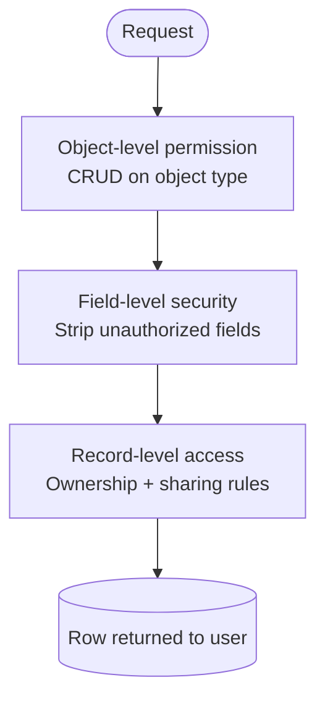

# Backend Modules Reference

OSC uses a Gradle multi-project structure. Each module has a single responsibility and an explicit public contract. The dependency direction is strict: higher-level modules depend on lower-level ones, never the reverse.

```
api → security, automation, query-engine, ai, integrations
automation → persistence, query-engine, security, kotlin-scripting
kotlin-scripting → persistence, query-engine, metadata-engine
query-engine → metadata-engine
security → metadata-engine
persistence → metadata-engine
integrations → persistence, automation
ai → (Spring AI only), kotlin-scripting (compile-check only, for script proposals)
metadata-engine → (no OSC deps)
```

---

## `metadata-engine`

**Purpose:** Load, cache, and serve metadata definitions. The foundation of all runtime behaviour.

**Key types:**

| Type | Description |
|---|---|
| `MetadataEngine` | Interface — all callers use this |
| `CaffeineMetadataEngine` | Implementation with Caffeine L1 cache per tenant |
| `ObjectDefinition` | Describes an object (api_name, label, auditable, …) |
| `FieldDefinition` | Describes a field (api_name, label, FieldType, required, constraints) |
| `FieldType` | Enum: `TEXT`, `NUMBER`, `BOOLEAN`, `DATE`, `DATETIME`, `LOOKUP`, `PICKLIST` |
| `FieldCoercionEngine` | Coerces raw values to the declared `FieldType` |
| `TenantContext` | Utilities for reading tenant_id from Reactor Context |
| `FieldAccessCounter` | Tracks hot fields for optional column promotion |

**Public API pattern:**

```java
Mono<ObjectDefinition> getObject(UUID tenantId, String apiName);
Flux<FieldDefinition> getFields(UUID tenantId, String objectApiName);
Mono<Void> invalidateCache(UUID tenantId);
```

**Rules:**
- Never bypass `MetadataEngine` — do not query `md_object` or `md_field` tables directly from other modules.
- Cache is tenant-scoped. Invalidate on metadata write operations.
- `FieldCoercionEngine` is the only place where raw String values are cast to typed values.

---

## `persistence`

**Purpose:** Dynamic, tenant-isolated CRUD over the universal `record` table using R2DBC + JSONB.

**Key types:**

| Type | Description |
|---|---|
| `DynamicPersistenceService` | Main service interface |
| `R2dbcRecordRepository` | R2DBC implementation |
| `R2dbcMetadataRepository` | Loads metadata definitions from DB (used by metadata-engine) |
| `RecordEntity` | Domain model (id, tenant_id, object_name, data, owner_id, timestamps) |
| `RecordInsertCommand` | Value object for create operations |
| `RecordUpdateCommand` | Value object for update operations |
| `PageRequest` | Pagination parameters |

**Flyway migrations:**

| Version | Description |
|---|---|
| `V1` | Core tables: tenant, md_object, md_field, md_validation_rule, md_layout, md_list_view, md_automation, record, outbox_event |
| `V2` | Seed objects: Account, Contact, Project |
| `V3` | Permission tables |
| `V4` | Automation audit log |

**Rules:**
- All queries bind `:tenantId` explicitly.
- JSONB `data` column is the primary storage for field values. Native column promotion is declared via `md_field.storage_kind = 'COLUMN'`.
- Never add runtime DDL (ALTER TABLE, CREATE INDEX) outside of Flyway migrations.

---

## `query-engine`

**Purpose:** Parse a SOQL-like query string and translate it to safe, parameterized SQL.

**Key types:**

| Type | Description |
|---|---|
| `QueryParser` | Parses query string to `SelectQuery` AST |
| `QueryTranslator` | Translates `SelectQuery` to `TranslatedQuery` (SQL + bindings) |
| `R2dbcQueryExecutor` | Executes `TranslatedQuery` against the DB |
| `SelectQuery` | AST root: fields, object, conditions, ordering, pagination |
| `Condition`, `BinaryOp` | AST nodes for WHERE clauses |
| `TranslatedQuery` | Final SQL string + ordered bind values |

**SOQL-like syntax:**

```
SELECT name, industry, annual_revenue
FROM Account
WHERE industry = 'Technology' AND annual_revenue > 1000000
ORDER BY name ASC
LIMIT 20 OFFSET 0
```

**Security rules:**
- Field names are validated against `MetadataEngine` — not interpolated directly into SQL.
- Object names are validated against `MetadataEngine` — not interpolated directly into SQL.
- The only dynamic SQL fragments allowed are `data->>'validated_field_name'` paths, which are safe because the field name is validated first.
- `QueryEngineInjectionTest` verifies injection payloads are rejected.

---

## `security`

**Purpose:** Tenant isolation, permission checking, field-level security (FLS), and record-level security (RLS) at the application layer.

**Key types:**

| Type | Description |
|---|---|
| `SecurityContext` | Holds tenant_id + user info from Reactor Context |
| `PermissionChecker` | Checks object-level CRUD permissions for the current user |
| `FlsFilter` | Strips unauthorized fields from a record before returning to client |
| `RecordAccessEvaluator` | Determines if a user can read/write a specific record |
| `OwnershipEvaluator` | Grants access if user is the record owner |
| `SharingRuleEvaluator` | Evaluates complex sharing rule expressions |
| `R2dbcPermissionRepository` | Loads permission sets, object permissions, field permissions from DB |

**Layers of record access control:**



**Rules:**
- `SecurityContext` is populated by `TenantContextFilter` and `UserContextFilter` — services must never construct it manually.
- FLS is applied on read (before returning to client) and on write (before persisting, to prevent unauthorized field writes).

---

## `automation`

**Purpose:** Validation rules, automation flows, user-code execution in a sandboxed DSL, and the transactional outbox for event delivery.

**Sub-components:**

### Validation
- `ValidationEngine` — evaluates validation rules on record save
- Rules are stored in `md_validation_rule.formula` as DSL expressions (e.g., `annual_revenue > 0 AND name != null`)
- Violations are collected and returned; saving fails if any active rule is violated

### DSL / Expression Engine
- `ExpressionParser` → `ExpressionNode` AST → `ExpressionEvaluator`
- Whitelist-based — only declared field references and arithmetic/logical operators are allowed
- `DslSecurityException` thrown if a disallowed construct is attempted

### Automation
- `AutomationEngine` — evaluates `md_automation` definitions on create/update/delete
- Trigger types: `BEFORE_INSERT`, `BEFORE_UPDATE`, `AFTER_INSERT`, `AFTER_UPDATE`, `AFTER_DELETE`
- Action types: `SET_FIELD`, `SEND_EMAIL`, `CALL_WEBHOOK`, `EXECUTE_CODE`
- `UserCodeExecutor` runs user-provided code in a restricted `WhitelistExpressionExecutor` — no I/O, no reflection

### Outbox
- `OutboxWorker` polls `outbox_event` table for `PENDING` events
- Delivers to `WebhookDeliveryService` with exponential backoff
- Events transition: `PENDING` → `DELIVERED` | `RETRY` → `DEAD_LETTER`
- Audit logged via `AuditLogger` for every automation execution

---

## `kotlin-scripting`

**Purpose:** Compile, cache, sandbox, and execute Kotlin Scripting user-code (Triggers, Batch jobs, Scheduled jobs, Invocable Actions) — the `UserCodeExecutor` implementation for imperative logic. Full design in **ADR-005**.

**Key types:**

| Type | Description |
|---|---|
| `KotlinScriptCompilerService` | Compiles source against a restricted `ScriptCompilationConfiguration` (import allowlist) |
| `CompiledScriptCache` | Caffeine, tenant-scoped, keyed by `(tenant_id, script_id, contentHash)` |
| `ScriptSandbox` | Per-tenant restricted `URLClassLoader` + runtime guard (timeout, CPU sampling, heap check, recursion depth) |
| `ExecutionContext` | Synchronous facade exposed to scripts — `records()`, `log()`, `now()`, `trigger` |
| `RecordOperations` | Synchronous CRUD/query facade over `DynamicPersistenceService`/`QueryEngine`, same FLS/RLS as the REST path |
| `ScriptExecutionAuditor` | Writes `script_execution_log` in the same transaction as the triggering record write |

**Rules:**
- This is the **only** module allowed to call `.block()` — and only inside classes scheduled on `Schedulers.boundedElastic()`. Enforced by `KotlinScriptingBlockingIsolationRule` (ArchUnit, scoped to this module).
- Scripts are compiled **on save**, never per-execution. A script cannot be activated (`md_script.is_active = true`) while `compile_errors` is non-empty.
- No script gets the raw R2DBC `DatabaseClient`, JWT secrets, network, filesystem, or reflection — only the `ExecutionContext` facade.
- Every execution runs with the invoking user's `SecurityContext` — object/field/record permissions are never bypassable from script code.

---

## `api`

**Purpose:** Spring Boot application entry point. Exposes the dynamic REST API and hosts the WebFilter chain.

**Key types:**

| Type | Description |
|---|---|
| `OscApplication` | Spring Boot entry point (`@SpringBootApplication`) |
| `DynamicRecordController` | REST controller for record CRUD (dynamic per object) |
| `TenantContextFilter` | Extracts `tenant_id` from JWT, sets Reactor Context |
| `UserContextFilter` | Extracts user identity from JWT |
| `CorrelationIdFilter` | Adds `X-Correlation-Id` to all responses |
| `RateLimitFilter` | Per-tenant rate limiting via `TenantRateLimiter` |
| `TenantAwareMdcFilter` | MDC logging context (tenant_id, user_id, correlation_id) |
| `HotFieldReportController` | `/internal/hot-fields` — returns field access stats |

**REST API routes:**

| Method | Path | Description |
|---|---|---|
| `GET` | `/api/v1/{objectName}/records` | List records (SOQL query or default list view) |
| `POST` | `/api/v1/{objectName}/records` | Create record |
| `GET` | `/api/v1/{objectName}/records/{id}` | Get record by ID |
| `PUT` | `/api/v1/{objectName}/records/{id}` | Full update |
| `PATCH` | `/api/v1/{objectName}/records/{id}` | Partial update |
| `DELETE` | `/api/v1/{objectName}/records/{id}` | Delete record |
| `GET` | `/api/v1/metadata/objects` | List object definitions |
| `GET` | `/api/v1/metadata/objects/{name}/fields` | List field definitions |
| `GET` | `/actuator/health` | Health check |
| `GET` | `/swagger-ui.html` | API docs |

**Filter chain order:**

```
CORS → CorrelationId → RateLimit → TenantContext → UserContext → MDC → TenantMetrics → Handler
```

---

## `ai`

**Purpose:** Spring AI integration. Translates natural language to metadata proposals or SOQL queries. Off the critical path.

**Key types:**

| Type | Description |
|---|---|
| `NlToMetadataService` | NL sentence → `MetadataSuggestion` (object + fields proposal) |
| `NlToQueryService` | NL question → `QuerySuggestion` (SOQL string) |
| `MetadataAiPort` | Interface for AI provider (mockable in tests) |
| `QueryAiPort` | Interface for query AI provider |
| `MetadataSuggestion` | Proposed object definition (validated against JSON Schema) |
| `QuerySuggestion` | Proposed SOQL string (subject to user permissions) |

**Rules:**
- AI output is always validated before use — `MetadataSuggestion` validated against `docs/contracts/metadata-object-schema.json`.
- AI services have no write access to any repository — they return proposals only.
- Requires `SPRING_AI_ANTHROPIC_API_KEY` environment variable.

---

## `integrations`

**Purpose:** Outbound webhooks with HMAC signing, and outbound HTTP client with domain allowlist.

**Key types:**

| Type | Description |
|---|---|
| `WebhookDeliveryService` | Delivers signed event payloads to subscriber URLs |
| `WebhookSubscription` | Tenant-owned subscription (url, event types, secret) |
| `OutboundHttpClient` | Interface for outbound HTTP calls (WebClient-backed) |
| `DomainAllowlist` | Validates target domain against per-tenant allowlist |
| `HmacSigner` | Signs payloads with HMAC-SHA256 using subscription secret |
| `OutboundAuditLog` | Records all outbound HTTP calls for audit trail |

**Security rules:**
- Target URL domain is validated against the tenant's `DomainAllowlist` before any HTTP call.
- All webhook payloads include `X-OSC-Signature` header (HMAC-SHA256 of the body).
- Consumers should verify the signature before processing the payload.
- `DomainNotAllowedException` is thrown for disallowed targets — never silently ignored.
