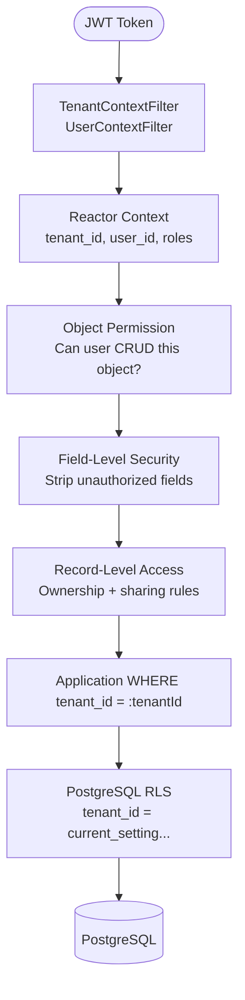
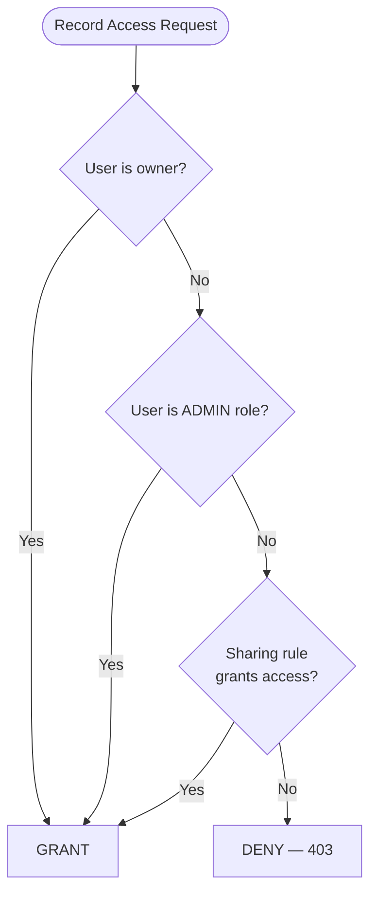

# Security Model

## Overview

OSC implements a multi-layered security model. Every layer is independent — a failure in one does not compromise another.



## 1. Authentication — JWT

Every request must carry a signed JWT in the `Authorization: Bearer <token>` header.

**Required JWT claims:**

| Claim | Type | Description |
|---|---|---|
| `sub` | string (UUID) | User ID |
| `tenant_id` | string (UUID) | Tenant ID |
| `roles` | string[] | User roles (e.g., `["ADMIN", "USER"]`) |
| `exp` | number | Expiration timestamp |

**Rules:**
- `tenant_id` is always read from the JWT claim — **never from the request body, path, or headers**.
- JWTs are validated in `TenantContextFilter` using `JWT_SECRET` (HMAC-SHA256).
- Expired or malformed tokens result in `401 Unauthorized`.
- Missing `tenant_id` claim results in `401 Unauthorized`.

## 2. Reactor Context Propagation

After JWT validation, tenant and user identity are stored in Reactor `Context` — not ThreadLocal.

```java
// TenantContextFilter sets context
ServerWebExchange exchange = ...; // incoming request
return chain.filter(exchange)
    .contextWrite(ctx -> ctx
        .put(TenantContext.TENANT_ID_KEY, tenantId)
        .put(UserContext.USER_ID_KEY, userId)
        .put(UserContext.ROLES_KEY, roles));

// Service reads context
public Mono<List<RecordEntity>> listRecords(String objectName) {
  return ReactiveSecurityContextHolder.getContext()
      .flatMap(ctx -> {
        UUID tenantId = ctx.getTenantId();
        return repository.findAll(tenantId, objectName);
      });
}
```

**Why not ThreadLocal?** Virtual threads and reactive scheduling can switch threads mid-pipeline. ThreadLocal values do not propagate across thread boundaries in reactive code. Reactor `Context` propagates correctly.

## 3. Object-Level Permissions

Before any CRUD operation, `PermissionChecker` verifies the user has the required permission.

**Permission matrix:**

| Operation | Required permission |
|---|---|
| `GET /records` | `READ` on object |
| `POST /records` | `CREATE` on object |
| `GET /records/{id}` | `READ` on object |
| `PUT/PATCH /records/{id}` | `UPDATE` on object |
| `DELETE /records/{id}` | `DELETE` on object |

Permission sets are defined in the `permission_set` and `object_permission` tables. Users are assigned permission sets via `permission_set_assignment`.

```java
permissionChecker.check(Operation.CREATE, "Account", securityContext)
    .switchIfEmpty(Mono.error(new ForbiddenException("No CREATE permission on Account")))
    .flatMap(allowed -> persistenceService.create(cmd));
```

## 4. Field-Level Security (FLS)

`FlsFilter` strips fields the current user is not authorized to see from every record before it is returned to the client.

**On read:** Fields without `READ` field permission are removed from the response.  
**On write:** Fields without `WRITE` field permission are ignored in the request body (not persisted).

```java
// Strip unauthorized fields from a RecordEntity
RecordEntity filtered = flsFilter.applyRead(record, fieldPermissions);
// filtered.data() only contains fields the user can read
```

FLS is applied at the API layer, after the persistence layer returns data. It never modifies data in the database.

## 5. Record-Level Access

`RecordAccessEvaluator` determines whether the current user can access a specific record, beyond object-level permissions.

**Access evaluation order:**



**Sharing rules** (`SharingRuleEvaluator`) evaluate criteria expressions defined in metadata. For example: "all records where `region = user.region`".

## 6. Multi-Tenancy — Defense in Depth

Two independent enforcement mechanisms ensure tenant isolation:

### Layer 1 — Application R2DBC Binds

Every query against a tenant-owned table includes:

```java
.bind("tenantId", tenantIdFromContext)
```

This is enforced by code convention and verified by the `TenantIsolationIntegrationTest` in every module.

### Layer 2 — PostgreSQL Row Level Security

```sql
-- Set before any query in the connection
SELECT set_config('app.current_tenant', '<tenant-id>', true);

-- RLS policy on record table (and all other tenant tables)
CREATE POLICY record_tenant_isolation ON record
  USING (tenant_id = current_setting('app.current_tenant')::uuid);
```

If the application layer's `tenantId` bind is missing (a bug), RLS blocks the query at the DB level. The two layers are completely independent.

**Cross-tenant data access is impossible by construction.** A tenant cannot see, modify, or delete another tenant's data even with a crafted request.

## 7. SQL Injection Prevention

**Primary defense:** R2DBC parameterized binds. User-controlled values are never concatenated into SQL strings.

**Secondary defense:** Query Engine validates all field names and object names against `MetadataEngine` before generating SQL. User-controlled names cannot introduce arbitrary SQL fragments.

**Verification:** `SqlInjectionPreventionTest` and `QueryEngineInjectionTest` send known injection payloads and assert:
- They are stored safely as string literals (not executed as SQL)
- The record/query table structure remains intact

## 8. Webhook Security — HMAC Signing

All outbound webhook payloads are signed with HMAC-SHA256.

```
X-OSC-Signature: sha256=<hmac-hex>
```

The signature is computed over the raw request body using the subscription's `secret`. Consumers must verify the signature before processing:

```python
import hmac, hashlib
expected = hmac.new(secret.encode(), body, hashlib.sha256).hexdigest()
assert hmac.compare_digest(expected, received_signature)
```

## 9. Rate Limiting

`RateLimitFilter` enforces per-tenant rate limits.

| Configuration | Default |
|---|---|
| Requests per second per tenant | `100` |
| Burst capacity | `2x RPS` |

Rate limit exceeded returns `429 Too Many Requests` with `Retry-After` header.

## 10. Secrets Management

Sensitive configuration (database credentials, JWT secret) is sourced from **AWS Secrets Manager** in production:

- `AwsSecretsManagerConfig` loads secrets at startup
- `DatabaseSecretsRefresher` rotates DB credentials without a restart

In development, secrets are provided via environment variables (`.env` file, gitignored).

## Security Test Requirements

Every PR that introduces new query paths, new endpoints, or new permission logic must include:

- [ ] `TenantIsolationIntegrationTest` — assert cross-tenant reads return empty
- [ ] `SqlInjectionPreventionTest` — assert malicious input is stored safely
- [ ] `PermissionCheckerTest` — assert unauthorized operations return 403
- [ ] `FlsFilterTest` — assert restricted fields are stripped from response
