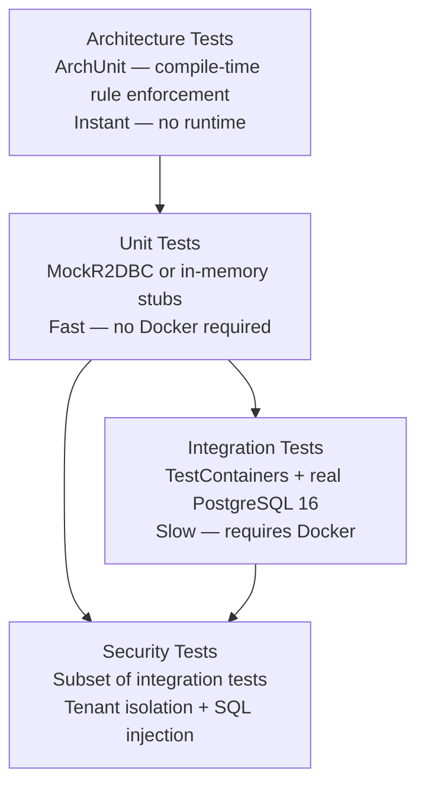

# Testing Guide

## Testing Philosophy

Tests are not optional — they are the definition of "done." The test suite provides:
1. Regression safety for tenant isolation (the highest-risk property)
2. SQL injection prevention verification
3. Architectural constraint enforcement (ArchUnit)
4. Confidence that reactive pipelines behave correctly

## Test Layers



## 1. Unit Tests

Unit tests cover individual class logic in isolation. Mock all external dependencies.

**Location:** `src/test/java/**/*Test.java` (no special suffix)  
**Framework:** JUnit 5 + Mockito + Reactor Test (`StepVerifier`)

### Reactive unit test pattern

```java
@ExtendWith(MockitoExtension.class)
class DefaultDynamicPersistenceServiceTest {

  @Mock
  R2dbcRecordRepository repository;

  @Mock
  MetadataEngine metadataEngine;

  DefaultDynamicPersistenceService service;

  @BeforeEach
  void setUp() {
    service = new DefaultDynamicPersistenceService(repository, metadataEngine);
  }

  @Test
  void create_validRecord_returnsCreatedEntity() {
    // Arrange
    var cmd = new RecordInsertCommand(TENANT_ID, "Account", Map.of("name", "Acme"));
    var entity = RecordEntity.of(TENANT_ID, "Account", Map.of("name", "Acme"));

    when(metadataEngine.getObject(TENANT_ID, "Account"))
        .thenReturn(Mono.just(accountDefinition));
    when(repository.insert(cmd)).thenReturn(Mono.just(entity));

    // Act + Assert
    StepVerifier.create(service.create(cmd))
        .expectNextMatches(r -> r.objectName().equals("Account"))
        .verifyComplete();
  }
}
```

### Key rules
- Use `StepVerifier.create(mono).expectNext(...).verifyComplete()` — never `.block()` in tests.
- Return `Mono.empty()` for missing mock setups, not `null`.
- Test error paths: `StepVerifier.create(mono).expectError(NotFoundException.class).verify()`.

## 2. Integration Tests

Integration tests use **TestContainers** to start a real PostgreSQL 16 container. Flyway migrations run before tests. These tests verify the full stack from service layer to database.

**Location:** `src/test/java/**/*IntegrationTest.java`  
**Requirement:** Docker must be running.

### TestContainers setup

```java
@SpringBootTest
@Testcontainers
@ActiveProfiles("test")
class TenantIsolationIntegrationTest {

  @Container
  static PostgreSQLContainer<?> postgres =
      new PostgreSQLContainer<>("postgres:16-alpine")
          .withDatabaseName("osc_test")
          .withUsername("osc")
          .withPassword("osc");

  @DynamicPropertySource
  static void configureDataSource(DynamicPropertyRegistry registry) {
    registry.add("spring.r2dbc.url", () ->
        "r2dbc:postgresql://" + postgres.getHost() + ":" +
        postgres.getMappedPort(5432) + "/osc_test");
    registry.add("spring.r2dbc.username", postgres::getUsername);
    registry.add("spring.r2dbc.password", postgres::getPassword);
    registry.add("spring.flyway.url", () ->
        "jdbc:postgresql://" + postgres.getHost() + ":" +
        postgres.getMappedPort(5432) + "/osc_test");
  }
}
```

## 3. Tenant Isolation Tests

**Every module that introduces queries must include a tenant isolation test.**

```java
@Test
void tenantA_cannotReadTenantB_records() {
  UUID tenantA = UUID.randomUUID();
  UUID tenantB = UUID.randomUUID();

  // Arrange: create a record for tenant B
  var cmd = new RecordInsertCommand(tenantB, "Account", Map.of("name", "Secret Corp"));
  StepVerifier.create(service.create(cmd)).expectNextCount(1).verifyComplete();

  // Act: query as tenant A
  StepVerifier.create(service.list(tenantA, "Account", PageRequest.of(0, 10)))
      // Assert: tenant A sees nothing
      .expectNextCount(0)
      .verifyComplete();
}

@Test
void tenantA_cannotUpdateTenantB_records() {
  // Similar pattern for updates
}

@Test
void tenantA_cannotDeleteTenantB_records() {
  // Similar pattern for deletes
}
```

## 4. SQL Injection Tests

**Every module that accepts user input for queries must include SQL injection tests.**

```java
@Test
void sqlInjection_inFieldValue_isStoredSafely() {
  String payload = "'; DROP TABLE record; --";
  var cmd = new RecordInsertCommand(TENANT_ID, "Account",
      Map.of("name", payload));

  StepVerifier.create(service.create(cmd))
      .expectNextMatches(r -> r.data().get("name").equals(payload))
      .verifyComplete();

  // Verify the table still exists and the value is stored literally
  StepVerifier.create(service.list(TENANT_ID, "Account", PageRequest.of(0, 1)))
      .expectNextCount(1)
      .verifyComplete();
}

@Test
void sqlInjection_inQueryField_isRejectedByParser() {
  String maliciousQuery =
      "SELECT * FROM Account WHERE name = ''; DROP TABLE record; --'";

  StepVerifier.create(queryEngine.execute(TENANT_ID, maliciousQuery))
      .expectError(ParseException.class)
      .verify();
}

@Test
void sqlInjection_inFieldName_isRejectedByMetadataValidation() {
  // Field names are validated against MetadataEngine
  String maliciousFieldName = "name'; DROP TABLE record; --";
  String query = "SELECT " + maliciousFieldName + " FROM Account";

  StepVerifier.create(queryEngine.execute(TENANT_ID, query))
      .expectError(FieldNotFoundException.class)
      .verify();
}
```

## 5. Architecture Tests (ArchUnit)

ArchUnit rules run as part of every `./gradlew test`. They enforce compile-time architectural constraints.

```java
@AnalyzeClasses(packages = "dev.osc")
class OscArchitectureTest {

  @ArchTest
  static final ArchRule noBlockCalls = noMethods()
      .that().areDefinedInAPackage("dev.osc..")
      .and().areNotAnnotatedWith(Test.class)
      .should().callMethod(Mono.class, "block")
      .because("Never block the event loop in production code");

  @ArchTest
  static final ArchRule noJdbcInProductionCode = noClasses()
      .that().resideInAPackage("dev.osc..")
      .and().areNotAnnotatedWith(Test.class)
      .should().accessClassesThat().resideInAPackage("java.sql..")
      .orShould().accessClassesThat().resideInAPackage("javax.sql..")
      .because("Use R2DBC instead of JDBC");

  @ArchTest
  static final ArchRule layerDependencies = layeredArchitecture()
      .consideringAllDependencies()
      .layer("api").definedBy("dev.osc.api..")
      .layer("security").definedBy("dev.osc.security..")
      .layer("automation").definedBy("dev.osc.automation..")
      .layer("query-engine").definedBy("dev.osc.queryengine..")
      .layer("persistence").definedBy("dev.osc.persistence..")
      .layer("metadata-engine").definedBy("dev.osc.metadata..")
      .whereLayer("metadata-engine").mayNotAccessAnyLayer()
      .whereLayer("persistence").mayOnlyAccessLayers("metadata-engine")
      .whereLayer("query-engine").mayOnlyAccessLayers("metadata-engine")
      .whereLayer("security").mayOnlyAccessLayers("metadata-engine");
}
```

## 6. Flyway Migration Tests

Each migration file is tested for correctness.

```java
@SpringBootTest
@Testcontainers
class FlywayMigrationV1Test {

  @Test
  void allTablesHaveRlsPolicies() {
    // Query pg_policies and assert RLS policies exist
    // for record, md_object, md_field, etc.
  }

  @Test
  void allTenantTablesHaveTenantIdColumn() {
    // Query information_schema.columns
    // Assert tenant_id NOT NULL on all tenant-scoped tables
  }
}
```

## 7. Testing the Frontend

**Location:** `frontend/renderer/src/**/*.test.tsx`  
**Framework:** Vitest + React Testing Library + MSW (Mock Service Worker)

```tsx
// Example: FieldRenderer renders text input for TEXT field type
describe('FieldRenderer', () => {
  it('renders TextInput for TEXT field', () => {
    const field: FieldDefinition = {
      apiName: 'name',
      label: 'Name',
      fieldType: 'TEXT',
      required: true,
    };

    render(<FieldRenderer field={field} value="" onChange={vi.fn()} />);
    expect(screen.getByRole('textbox', { name: 'Name' })).toBeInTheDocument();
  });
});
```

MSW intercepts API calls in tests:

```ts
// src/test-setup.ts
import { setupServer } from 'msw/node';
import { handlers } from './api/mocks/handlers';

const server = setupServer(...handlers);
beforeAll(() => server.listen());
afterEach(() => server.resetHandlers());
afterAll(() => server.close());
```

## Running Tests

```bash
# All backend modules
./gradlew test

# Single module
./gradlew :backend:persistence:test

# With HTML coverage report
./gradlew test jacocoTestReport
# Report at: backend/<module>/build/reports/jacoco/test/html/index.html

# Frontend
cd frontend/renderer && npm test

# Frontend with coverage
cd frontend/renderer && npm run coverage
```

## Definition of Done — Test Checklist

- [ ] Unit tests for all new business logic
- [ ] Integration test with TestContainers for new queries
- [ ] `TenantIsolationIntegrationTest` for any new query path
- [ ] `SqlInjectionPreventionTest` for any new user input path
- [ ] ArchUnit passes (no `.block()`, no JDBC, correct layer deps)
- [ ] Flyway migration test if a new migration was added
- [ ] Frontend component tests for new UI components
- [ ] All tests pass with `./gradlew test`
