# Automation Guide

OSC lets you automate business processes and enforce data rules without writing code. There are two tools: **Validation Rules** (data quality) and **Automations** (business logic triggers).

## Validation Rules

A validation rule prevents a record from being saved if data doesn't meet your criteria.

### How it works

1. User creates or updates a record
2. OSC evaluates all active validation rules for the object
3. If **any** rule formula evaluates to `false`, the save is blocked
4. The user sees the rule's error message

### Creating a validation rule

```http
POST /api/v1/metadata/objects/Invoice__c/validation-rules
Authorization: Bearer <token>
Content-Type: application/json

{
  "apiName": "amount_must_be_positive",
  "label": "Amount Must Be Positive",
  "formula": "amount > 0",
  "errorMessage": "Invoice amount must be greater than zero.",
  "active": true
}
```

### Validation rule properties

| Property | Description |
|---|---|
| `apiName` | Unique identifier |
| `label` | Display name |
| `formula` | Expression that must be `true` for the save to succeed |
| `errorMessage` | Message shown to the user when the rule fails |
| `active` | `true` (enforced) or `false` (disabled). Default: `true` |

### Formula expressions

The formula language supports:

| Feature | Syntax | Example |
|---|---|---|
| Field reference | `fieldApiName` | `amount` |
| Comparison | `=`, `!=`, `>`, `>=`, `<`, `<=` | `amount > 0` |
| Null check | `fieldName != null` | `due_date != null` |
| String check | `fieldName != ''` | `invoice_number != ''` |
| Logical AND | `AND` | `amount > 0 AND status != null` |
| Logical OR | `OR` | `status = 'Draft' OR status = 'Sent'` |
| Negation | `NOT` | `NOT (amount = 0)` |
| Grouping | `(...)` | `(amount > 0) AND (due_date != null)` |

### Examples

```json
// Invoice must have a due date when status is Sent
{
  "formula": "status != 'Sent' OR due_date != null",
  "errorMessage": "A due date is required before sending the invoice."
}

// Amount within range
{
  "formula": "amount >= 0.01 AND amount <= 999999.99",
  "errorMessage": "Amount must be between $0.01 and $999,999.99."
}

// Contact must have either email or phone
{
  "formula": "email != null OR phone != null",
  "errorMessage": "A contact must have at least an email or phone number."
}
```

### Listing and managing validation rules

```http
GET    /api/v1/metadata/objects/Invoice__c/validation-rules
PATCH  /api/v1/metadata/objects/Invoice__c/validation-rules/amount_must_be_positive
DELETE /api/v1/metadata/objects/Invoice__c/validation-rules/amount_must_be_positive
```

To temporarily disable a rule without deleting it: `PATCH` with `{ "active": false }`.

---

## Automations

An automation executes actions automatically when records are created, updated, or deleted.

### Trigger types

| Trigger | When it fires |
|---|---|
| `BEFORE_INSERT` | Before a new record is saved — can modify field values |
| `BEFORE_UPDATE` | Before an existing record is updated — can modify field values |
| `AFTER_INSERT` | After a new record is saved — cannot modify the triggering record |
| `AFTER_UPDATE` | After an existing record is updated — cannot modify the triggering record |
| `AFTER_DELETE` | After a record is deleted |

### Action types

| Action | Description |
|---|---|
| `SET_FIELD` | Set a field value on the triggering record (BEFORE triggers only) |
| `SEND_EMAIL` | Send a notification email |
| `CALL_WEBHOOK` | POST a payload to an external URL |
| `EXECUTE_CODE` | Run a simple expression script |

### Creating an automation

```http
POST /api/v1/metadata/objects/Invoice__c/automations
Authorization: Bearer <token>
Content-Type: application/json

{
  "apiName": "auto_set_sent_date",
  "label": "Set Sent Date When Status Changes to Sent",
  "triggerType": "BEFORE_UPDATE",
  "conditions": [
    { "field": "status", "operator": "=", "value": "Sent" }
  ],
  "actions": [
    {
      "type": "SET_FIELD",
      "fieldApiName": "sent_date",
      "value": "TODAY"
    }
  ],
  "active": true
}
```

### Automation with webhook

```http
POST /api/v1/metadata/objects/Invoice__c/automations
Authorization: Bearer <token>
Content-Type: application/json

{
  "apiName": "notify_accounting_on_paid",
  "label": "Notify Accounting When Invoice is Paid",
  "triggerType": "AFTER_UPDATE",
  "conditions": [
    { "field": "status", "operator": "=", "value": "Paid" }
  ],
  "actions": [
    {
      "type": "CALL_WEBHOOK",
      "subscriptionApiName": "accounting_system_webhook"
    }
  ],
  "active": true
}
```

The webhook payload includes the full record data and the event type. The target URL must be registered in your tenant's webhook subscriptions.

### Automation properties

| Property | Description |
|---|---|
| `apiName` | Unique identifier |
| `label` | Display name |
| `triggerType` | When the automation fires |
| `conditions` | Optional conditions — automation only runs if all conditions match |
| `actions` | List of actions to execute (in order) |
| `active` | `true` (enabled) or `false` (disabled) |

### Conditions

A condition limits when an automation fires:

```json
{
  "field": "status",
  "operator": "=",
  "value": "Paid"
}
```

Supported operators: `=`, `!=`, `>`, `>=`, `<`, `<=`, `IS_NULL`, `IS_NOT_NULL`

Multiple conditions are evaluated with AND logic.

### SET_FIELD special values

| Value | Description |
|---|---|
| `TODAY` | Current date (ISO 8601) |
| `NOW` | Current datetime |
| `CURRENT_USER` | ID of the user making the change |
| Any literal | The literal value |

---

## Automation Execution Order

```mermaid
flowchart TD
  SAVE([User saves record]) --> VALID[Validation Rules\nall must pass]
  VALID -->|Any failure| REJECT[Block save\nShow error message]
  VALID -->|All pass| BEFORE[BEFORE_INSERT/UPDATE automations\nfield modifications]
  BEFORE --> DB[(Save to database)]
  DB --> AFTER[AFTER_INSERT/UPDATE automations\nwebhooks, emails, scripts]
  AFTER --> RESPOND([Return response to user])
```



- **BEFORE** automations run synchronously before the DB write. They can modify field values.
- **AFTER** automations run asynchronously via the outbox after the DB write succeeds.
- Automation failures in AFTER triggers are logged and retried — they do not cause the original save to fail.

---

## Webhook Subscriptions

Before an automation can call a webhook, you must register the target URL.

```http
POST /api/v1/integrations/webhook-subscriptions
Authorization: Bearer <token>
Content-Type: application/json

{
  "apiName": "accounting_system_webhook",
  "targetUrl": "https://accounting.example.com/osc-events",
  "eventTypes": ["AFTER_UPDATE", "AFTER_INSERT"],
  "secret": "your-shared-secret-for-hmac-signing",
  "active": true
}
```

OSC signs every webhook payload with HMAC-SHA256 using the `secret`. Your receiver should verify the `X-OSC-Signature` header.

---

## Listing and Managing Automations

```http
GET    /api/v1/metadata/objects/Invoice__c/automations
PATCH  /api/v1/metadata/objects/Invoice__c/automations/auto_set_sent_date
DELETE /api/v1/metadata/objects/Invoice__c/automations/auto_set_sent_date
```
