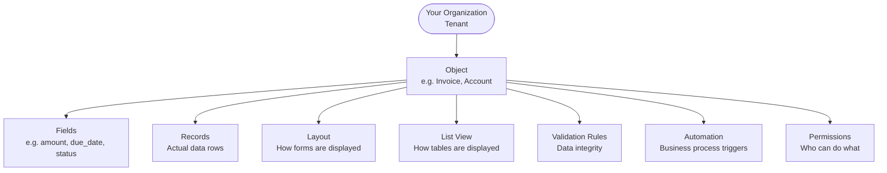

# Core Concepts

Understanding these concepts is the foundation for working with OSC effectively.

## The OSC Data Model



---

## Tenant

Your organization's isolated workspace on OSC. Everything you create (objects, records, configurations) belongs to your tenant and is invisible to all other tenants.

You cannot accidentally see or modify another organization's data.

---

## Object

An **object** is a type of business entity. Think of it as a table definition — it describes *what kind of data* you store, but does not contain the data itself.

Examples: `Account`, `Contact`, `Project`, `Invoice`, `Support_Ticket`

An object has:
- An **API Name** (e.g., `Invoice`) — used in API calls and queries
- A **Label** (e.g., `Invoice`) — shown in the UI
- **Fields** — the attributes of the object

Standard objects (`Account`, `Contact`, `Project`) are provided out of the box. You can create custom objects for your specific needs.

---

## Field

A **field** defines one attribute of an object — its name, data type, and rules.

| Property | Description |
|---|---|
| **API Name** | Unique identifier (e.g., `annual_revenue`) |
| **Label** | Display name (e.g., `Annual Revenue`) |
| **Field Type** | Data type — see below |
| **Required** | Whether a value must be provided |
| **Constraints** | Additional rules (min/max, regex, allowed values) |

### Field Types

| Type | Description | Example |
|---|---|---|
| `TEXT` | Free-form text | `"Acme Corp"` |
| `NUMBER` | Numeric value (integer or decimal) | `42000.00` |
| `BOOLEAN` | True/false | `true` |
| `DATE` | Calendar date | `"2026-01-15"` |
| `DATETIME` | Date and time with timezone | `"2026-01-15T09:00:00Z"` |
| `PICKLIST` | One value from a fixed list | `"Open"`, `"Closed"` |
| `LOOKUP` | Reference to a record of another object | UUID of a Contact |

---

## Record

A **record** is one instance of an object — the actual data.

Example: a `Contact` record might be `{ first_name: "Jane", last_name: "Doe", email: "jane@example.com" }`.

Records have system-managed metadata:
- `id` — unique identifier (UUID)
- `created_at` — creation timestamp
- `updated_at` — last modification timestamp
- `owner_id` — the user who created/owns the record

---

## Layout

A **layout** controls how a record's fields are displayed in a form (create/edit/detail view). You can:
- Group fields into named **sections**
- Arrange fields in columns
- Show or hide fields for different views

Layouts do not affect the data — only the presentation.

---

## List View

A **list view** defines the columns displayed when listing records of an object. You can:
- Choose which fields appear as columns
- Set the default sort order
- Apply filters

---

## Validation Rule

A **validation rule** ensures data quality. It evaluates a formula expression when a record is saved. If the formula returns `false`, the save is blocked and an error message is shown to the user.

Example formula: `amount > 0 AND due_date != null`  
Error message: `"Amount must be positive and due date is required."`

Validation rules run on every create and update. They are declared in the metadata and require no code.

---

## Automation

An **automation** triggers actions automatically when records change.

An automation has:
- A **trigger type** — when it fires: `BEFORE_INSERT`, `BEFORE_UPDATE`, `AFTER_INSERT`, `AFTER_UPDATE`, `AFTER_DELETE`
- **Conditions** — optional filters (e.g., only fire when `status` changes to `"Closed"`)
- **Actions** — what to do: set a field value, send a notification, call a webhook, execute a script

---

## Permission

OSC controls access at multiple levels:

| Level | Description |
|---|---|
| **Object permission** | Can this user create/read/update/delete records of this object? |
| **Field permission** | Can this user read/write this specific field? |
| **Record permission** | Can this user access this specific record (ownership/sharing)? |

Permissions are grouped into **permission sets** and assigned to users. A user with no `READ` permission on an object sees no records of that type.

---

## Query Language

OSC supports a SOQL-like query syntax for reading records:

```sql
SELECT field1, field2, field3
FROM ObjectApiName
WHERE field1 = 'value' AND field2 > 100
ORDER BY field1 ASC
LIMIT 50 OFFSET 0
```

This syntax is used in:
- API `GET /records` requests (as the `q` query parameter)
- List view filter definitions
- Automation conditions

See [records.md](records.md) for full query syntax reference.
