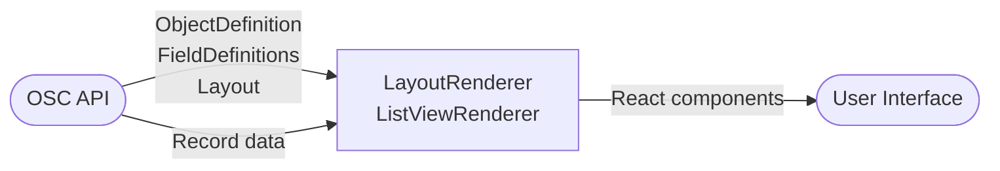

# Views and Layouts

OSC separates **what data you store** (objects and fields) from **how data is displayed** (layouts and list views). This lets administrators customize the UI without changing the data model.

## List Views

A **list view** defines which columns appear in the table when listing records, and the default sort order.

### Creating a list view

```http
POST /api/v1/metadata/objects/Invoice__c/list-views
Authorization: Bearer <token>
Content-Type: application/json

{
  "apiName": "overdue_invoices",
  "label": "Overdue Invoices",
  "columns": [
    { "fieldApiName": "invoice_number", "label": "Invoice #", "width": 150 },
    { "fieldApiName": "amount",         "label": "Amount",    "width": 120 },
    { "fieldApiName": "due_date",       "label": "Due Date",  "width": 120 },
    { "fieldApiName": "account_id",     "label": "Account",   "width": 200 }
  ],
  "defaultSortField": "due_date",
  "defaultSortDirection": "ASC",
  "filterExpression": "status = 'Sent' AND due_date < TODAY"
}
```

### List view properties

| Property | Required | Description |
|---|---|---|
| `apiName` | Yes | Unique identifier for this view |
| `label` | Yes | Display name shown in the UI |
| `columns` | Yes | Ordered list of columns to display |
| `defaultSortField` | No | Field to sort by default |
| `defaultSortDirection` | No | `ASC` or `DESC`. Default: `ASC` |
| `filterExpression` | No | Pre-applied filter (SOQL WHERE clause) |

### Column properties

| Property | Required | Description |
|---|---|---|
| `fieldApiName` | Yes | Must be a valid field on the object |
| `label` | No | Override the field label for this view |
| `width` | No | Column width in pixels |

### Using a list view

```http
GET /api/v1/Invoice__c/records?listView=overdue_invoices
Authorization: Bearer <token>
```

### Listing available list views

```http
GET /api/v1/metadata/objects/Invoice__c/list-views
Authorization: Bearer <token>
```

---

## Layouts

A **layout** controls how fields are arranged in the record form (create, edit, and detail views).

Layouts are organized into **sections**, each with a title and one or two columns of fields.

### Creating a layout

```http
POST /api/v1/metadata/objects/Invoice__c/layouts
Authorization: Bearer <token>
Content-Type: application/json

{
  "apiName": "default",
  "label": "Default Layout",
  "sections": [
    {
      "label": "Invoice Details",
      "columns": 2,
      "fields": [
        { "fieldApiName": "invoice_number", "column": 1, "row": 1 },
        { "fieldApiName": "status",         "column": 2, "row": 1 },
        { "fieldApiName": "amount",         "column": 1, "row": 2 },
        { "fieldApiName": "due_date",       "column": 2, "row": 2 }
      ]
    },
    {
      "label": "Account Information",
      "columns": 1,
      "fields": [
        { "fieldApiName": "account_id", "column": 1, "row": 1 }
      ]
    }
  ]
}
```

### Layout section properties

| Property | Required | Description |
|---|---|---|
| `label` | Yes | Section heading displayed in the form |
| `columns` | No | `1` or `2`. Default: `2` |
| `fields` | Yes | Fields in this section, with position |

### Field position

| Property | Description |
|---|---|
| `fieldApiName` | The field to place |
| `column` | `1` (left) or `2` (right) |
| `row` | Row within the section (1-based) |

Fields not included in the layout are hidden in the form but still stored on the record.

### Using a layout

The frontend renderer automatically uses the default layout. To use a specific layout:

```http
GET /api/v1/Invoice__c/records/7c9e6679...?layout=default
Authorization: Bearer <token>
```

The response includes the layout metadata alongside the record data, which the frontend uses to render the form.

### Listing layouts

```http
GET /api/v1/metadata/objects/Invoice__c/layouts
Authorization: Bearer <token>
```

---

## How the Frontend Uses Layouts and List Views

The OSC frontend renderer is **metadata-driven** — it reads the layout or list view definition and renders the appropriate UI components automatically.



When you update a layout, all users see the new arrangement immediately — no deployments, no frontend code changes.
